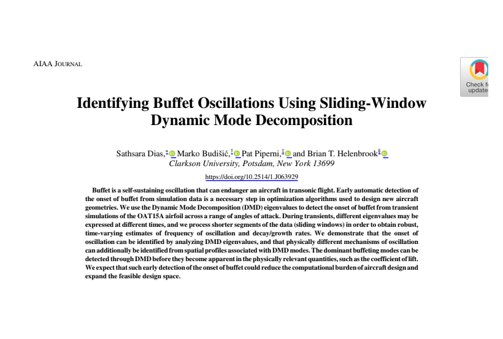
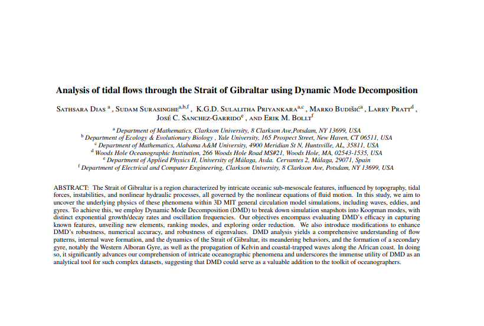

# 👋 Hi there, I’m **Sathsara Dias**

🌊 **Applied Mathematician** | ✈️ **Data Scientist** | 🤖 **Machine Learning Engineer**

---

## 💼 About Me

🎓 PhD in Mathematics (Clarkson University, 2024)  
🔬 Specialized in:
- Reduced-order modeling (DMD, Koopman, POD)
- Predictive analytics for physical systems
- Transonic buffet detection in aerospace  
- Tidal oscillation modeling in oceanographic flows

---

## 🔍 Actively Seeking

✅ Machine Learning Scientist roles  
✅ Data Science or LLM/NLP research positions  
✅ Advanced analytics, predictive modeling, real-time systems

---

## 💪 What I Excel At

- 🏗 Building end-to-end ML pipelines (from data prep to deployment)  
- 🧠 Unsupervised learning, time-series forecasting, statistical modeling  
- ⚙️ High-performance computing, cloud workflows, GPU acceleration  
- 🌐 Expert in Hugging Face, TensorFlow, PyTorch, Scikit-learn, AWS

---

## 📌 Featured Research

  <b>✈️ AIAA Journal</b>:  
  <a href="https://arc.aiaa.org/doi/10.2514/1.J063929">
    Identifying Buffet Oscillations Using Sliding-Window Dynamic Mode Decomposition (Reduced-order Modeling of Buffet Oscillations)
  </a>  
   
  <i>Advanced DMD techniques for aerospace buffet detection</i>

  
  

---

  <b>🌊 Journal of Physical Oceanography (accepted)</b>:  
  <a href="https://arxiv.org/pdf/2311.01377">
    Analysis of Tidal Flows Through the Strait of Gibraltar Using Dynamic Mode Decomposition
  </a>  
   
  <i>Oceanographic forecasting using data-driven methods</i>

  
  

---

## 🛠 Tech Stack

---

## 📈 GitHub Stats

---

## 🌐 Connect With Me

  
  

---

## 🏆 Highlights

✅ AIAA publication on transonic buffet detection  
✅ JPO accepted paper on tidal forecasting  
✅ Experience teaching Data Analytics, Advanced Algorithms  
✅ Contributor to open-source and advanced GitHub workflows

---

## 📽 Featured Media

  

---

🎯 **Open to collaborations, R&D partnerships, and exciting projects!**

---

